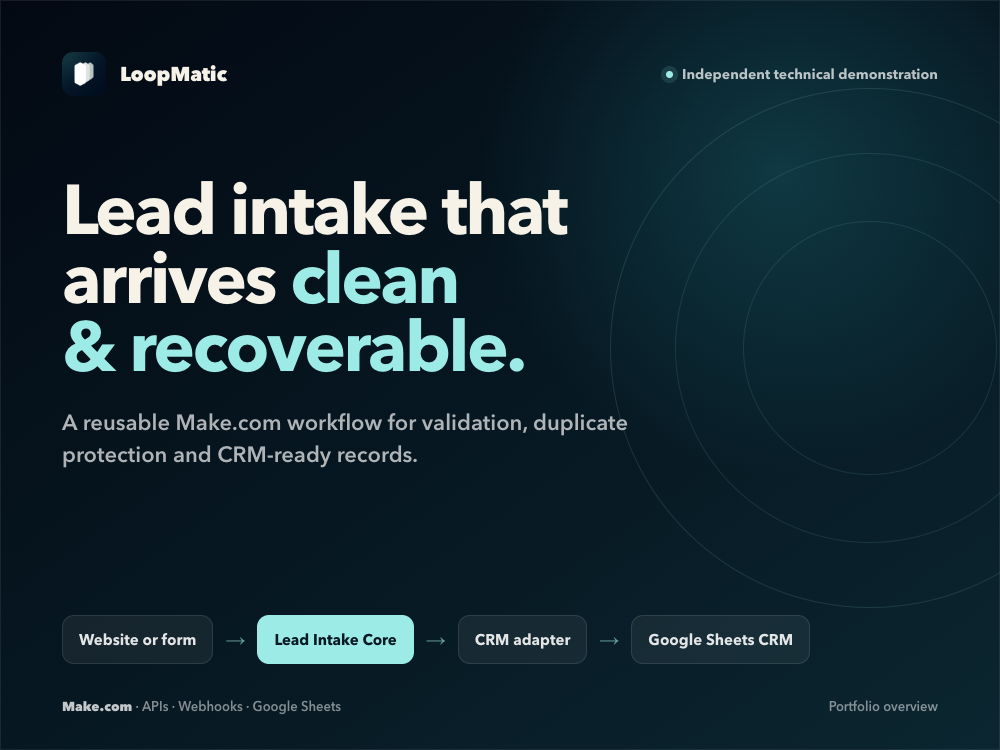
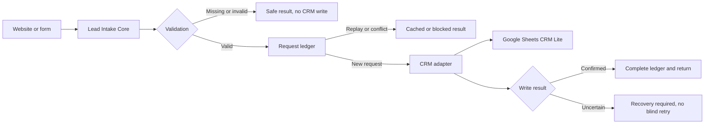

# LeadFlow Automation Demo

[](https://github.com/danielbanidolati/leadflow-automation-demo/actions/workflows/validate.yml)



A sanitized Make.com demonstration for receiving leads, validating and normalizing them, preventing duplicate processing, and sending approved records to a Google Sheets CRM through a separate adapter.

> This is an independent technical demonstration built with synthetic data. It is not client work, production certification, or proof of business results.

## What it shows

- Typed lead intake with stable request IDs.
- Required-field, format, length, and control-character validation.
- Email and phone normalization.
- Deterministic outcomes such as `APPROVED`, `NEEDS_REVIEW`, `MISSING_DATA`, `INVALID_INPUT`, `DUPLICATE`, and `RECOVERY_REQUIRED`.
- Replay and request-conflict protection through a privacy-conscious ledger.
- A reusable Core that stays separate from the CRM-specific adapter.
- Google Sheets writes in RAW mode to reduce spreadsheet formula risk.
- Fail-closed recovery when a CRM write may have succeeded but cannot be confirmed.

## Architecture



The Core handles validation, normalization, idempotency, and result handling. The adapter owns the destination-specific work. A different CRM can replace the Google Sheets adapter without rebuilding the Core.

See [the architecture notes](docs/architecture.md) for the design decisions and interface boundaries.

## Repository contents

```text
blueprints/     Sanitized Make.com blueprint exports
contract/       Typed Core and adapter interfaces
docs/           Architecture, setup, and recovery notes
examples/       Synthetic requests, expected outcomes, and CRM schema
scripts/        Dependency-free structural and sanitization checks
```

## Review it locally

The validation script uses Node.js and has no package dependencies.

```bash
npm test
```

It checks the expected blueprint structure, required placeholders, module boundaries, synthetic example policy, and common secret patterns. It does not claim that a live Make.com deployment has been production-certified.

## Importing the demo

The blueprints intentionally contain unbound resources. After import, you must configure:

- a fixed client key and environment;
- a dedicated Make Data Store for the request ledger;
- the CRM adapter subscenario;
- a client-owned Google Sheets connection;
- a client-owned spreadsheet with the documented `LEADS` schema.

Use only synthetic records during setup. Follow [the setup guide](docs/setup.md) and [the recovery guide](docs/safety-and-recovery.md) before considering any live use.

## Evidence boundary

This repository demonstrates the implementation pattern and the controls built into the sanitized package. It does not include private execution logs, customer data, connection IDs, scenario IDs, spreadsheet IDs, webhook URLs, credentials, or production approval.
