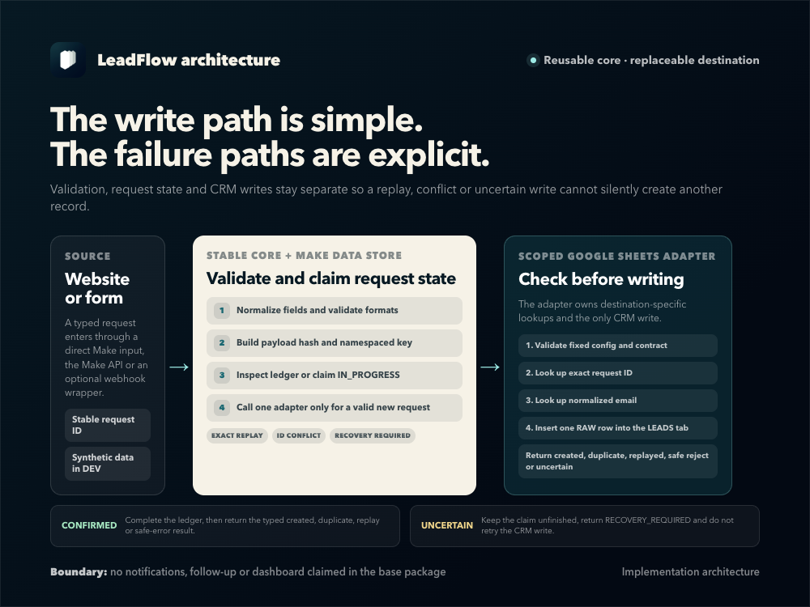

# Architecture

## Design goal

The system separates reusable lead-processing logic from destination-specific CRM work. This keeps validation, normalization, replay protection, and recovery behavior consistent when the destination changes.

## Component 1: Lead Intake Core

The Core accepts a typed request containing a stable `request_id`, name, email, optional phone, message, source, and submitted time.

Its responsibilities are:

1. Normalize text, email, phone, and timestamps.
2. Validate required fields, formats, lengths, and control characters.
3. Derive a stable lead ID and payload hash.
4. Claim a namespaced request-ledger key.
5. Distinguish a new request, exact replay, changed-payload conflict, and unfinished prior request.
6. Call exactly one CRM adapter for a valid new request.
7. Complete the ledger only after a durable adapter result is confirmed.
8. Return a typed result to the caller.

The Core contains no Google Sheets, email, HTTP, webhook, or CRM-specific module.

## Component 2: Google Sheets CRM Lite adapter

The adapter receives normalized data through the versioned contract. It checks for an existing request ID and normalized email before inserting a new row.

Its responsibilities are:

1. Confirm the caller's fixed client key, environment, and contract version.
2. Search for a prior request ID.
3. Search for a duplicate normalized email.
4. Write a new record with its final status when no match exists.
5. Return a typed `CREATED`, `DUPLICATE`, `REPLAYED`, `REJECTED_SAFE`, or `UNCERTAIN` result.

Every spreadsheet write uses RAW mode. This is one layer of protection against formula-like input being interpreted as a spreadsheet formula.

## Idempotency and privacy

The request ledger key uses the environment, client key, and a hash of the request ID. The ledger stores processing state and payload hashes, not the lead's raw name, email, phone, message, or request ID.

An exact completed replay can return a safe cached result without creating another CRM record. A changed payload under the same request ID is rejected as a conflict. An unfinished prior claim returns `RECOVERY_REQUIRED`.

## Why uncertain writes fail closed

A timeout after a create operation does not prove that the destination rejected the record. Automatically retrying could create a duplicate. The adapter therefore returns an uncertain result, and the Core leaves the request held for reconciliation.

## Request paths

| Condition | Component decision | Durable effect |
| --- | --- | --- |
| Required data missing or malformed | Core returns `MISSING_DATA` or `INVALID_INPUT` | No ledger claim and no CRM call |
| Completed ledger entry with the same payload | Core returns the cached result | No adapter call and no new CRM row |
| Same request ID with a changed payload | Core returns `REQUEST_ID_CONFLICT` | No adapter call and no new CRM row |
| Unfinished or unsafe ledger state | Core returns `RECOVERY_REQUIRED` | Existing claim remains for reconciliation |
| Valid new request | Core writes an `IN_PROGRESS` claim, then calls the adapter | One adapter call |
| Adapter finds the exact request and matching payload | Adapter returns `REPLAYED` | No new CRM row |
| Adapter finds the request ID with a different payload | Adapter returns a safe rejection | No new CRM row |
| Adapter finds the normalized email under another request | Adapter returns `DUPLICATE` | No new CRM row |
| Adapter finds no request or email match | Adapter inserts one RAW row into `LEADS` | One new CRM row |
| Lookup fails before any write | Adapter returns a safe rejection | Core records a safe CRM error |
| Row creation may have succeeded but is not confirmed | Adapter returns `UNCERTAIN` | Core leaves the claim unfinished and requires recovery |

Confirmed `CREATED`, `DUPLICATE`, `REPLAYED`, and safely rejected results are finalized in the ledger before the Core returns. Unknown or uncertain adapter results are not finalized and are never marked safe for an automatic retry.

See [Safety and recovery](safety-and-recovery.md) for the operator procedure.
