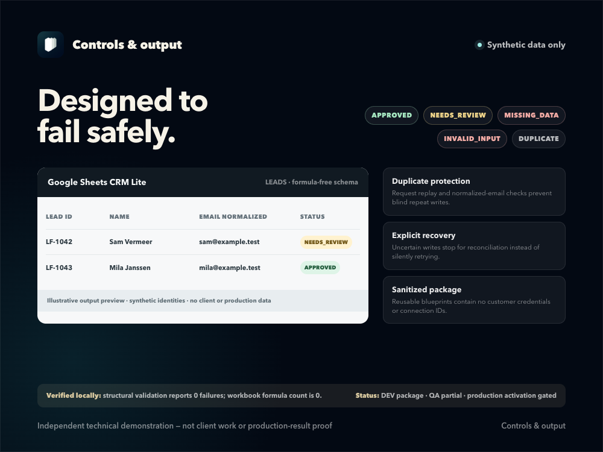

# Safety and recovery

## Built-in controls

- Fixed client and environment values cannot be supplied by the lead request.
- Required fields, formats, lengths, and control characters are checked before any CRM call.
- Request IDs and normalized payloads support replay and conflict detection.
- The ledger avoids raw lead identity and message fields.
- The adapter checks request ID before normalized email.
- Google Sheets writes use RAW mode.
- A destination write that cannot be confirmed is treated as uncertain.
- Uncertain writes are not marked retryable.

## Recovery procedure

Use this process when a request returns `RECOVERY_REQUIRED` or a CRM write may have succeeded without a confirmed response.

### Stop

- Do not resubmit with a new request ID.
- Do not delete the ledger claim merely to clear the error.
- Do not blindly retry the create operation.

### Inspect

1. Record the request ID and execution time.
2. Inspect the failed Core and adapter executions without changing them.
3. Read the matching ledger record.
4. Search the CRM by exact request ID.
5. If necessary, search by normalized email and compare timestamps and fields.

### Decide from evidence

- If the write definitely did not happen, correct the cause and retry the same request ID once after approval.
- If the write definitely happened, treat the existing record as authoritative and complete only the matching ledger record.
- If the write remains uncertain, keep the request held and escalate it for manual review.

Recovery is complete only when one authoritative CRM record exists, the ledger agrees with it, and an exact replay creates nothing new.
